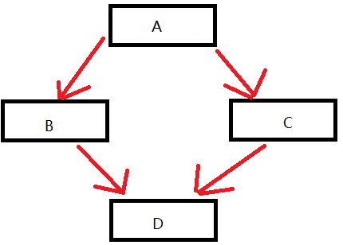

### 一维数组
数组就是一个集合，里面存放了相同类型的数据元素。  
* 特点1：数组中的每个数据元素都是相同的数据类型
* 特点2：放在一块连续的内存空间中。
一维数组定义的三种方式：
1. `数据类型  数组名[数组长度];`
2. `数据类型  数组名[数组长度] = {值1，值2，...}`
3. `数据类型  数组名[] = {值1，值2，...}`
**一维数组名称的用途**：
1. 可以统计整个数组在内存中的空间大小(占用多少byte)
2. 可以获取数组在内存中的首地址
```c
#include <iostream>
using namespace std;

int main()
{
    int arr1[] = {1, 2, 3};

    for (int i = 0; i < 3; i++) // 3代表数组中元素的个数
    {
        cout << arr1[i] << endl;
    }
    return 0;
}
```
示例程序1：数组元素逆序(数组元素首位互换)
```c
#include <iostream>
using namespace std;

void Reverse(int a[], int n)
{
    // i为首元素，j为尾元素
    for (int i = 0, j = n - 1; i < j; i++, j--)
    {
        // 首尾交换
        int temp = a[i];
        a[i] = a[j];
        a[j] = temp;
    }
}

int main()
{
    int arr[] = {1, 3, 2, 5, 4};
    int n = sizeof(arr) / sizeof(int);
    Reverse(arr, n);
    for (int i = 0; i < n; i++)
    {
        cout << arr[i] << ",";
    }
    cout << endl;
    return 0;
}
```
示例程序2：冒泡排序
1. 比较相邻元素的大小,如果第一个比第二个大，就交换他们两个
```c
#include <iostream>
using namespace std;

void Bubble_Sort(int arr[], int n)
{
    for (int i = 0; i < n - 1; i++) // 外循环控制循环次数，n个数需要排n-1次
    {
        bool flag = true;                   // 没有排序为true，本趟有排序为false
        for (int j = 0; j < n - 1 - i; j++) // 每排1次，趟数减1
        {
            if (arr[j] > arr[j + 1])
            {
                flag = false;
                int temp = arr[j];
                arr[j] = arr[j + 1];
                arr[j + 1] = temp;
            }
        }
        if (flag) // 已完成全部排序，提前结束
        {
            break;
        }

        // 输出每次排序的结果
        cout << "第" << i + 1 << "次：";
        for (int k = 0; k < n; k++)
        {
            cout << arr[k] << ",";
        }
        cout << endl;
    }
}

int main()
{
    int arr[] = {3,2,1};
    int n = sizeof(arr) / sizeof(int);
    Bubble_Sort(arr, n);
    return 0;
}
```
### 二维数组
二维数组就是在一维数组上，多加一个维度。   
二维数组的定义方式：**行数可以省略，列数不能省略**
```c
#include <iostream>
using namespace std;

int main()
{
    // 数组类型  数组名[行数][列数]
    int arr1[2][3] = {{1, 2, 3}, {4, 5, 6}};  // 推荐这种命名方式
    int arr2[2][3] = {1, 2, 3, 4, 5, 6};
    int arr3[][3] = {1, 2, 3, 4, 5, 6};

    // 遍历二维数组，外层循环打印行数，内层循环打印列数
    for (int i = 0; i < 2; i++)
    {
        for (int j = 0; j < 3; j++)
        {
            cout << arr3[i][j] << " ";  // 每一行的元素
        }
        cout << endl;
    }
    return 0;
}
```
#### 二维数组数组名称
二维数组名称的作用与一维数组类似。
1. 可以查看二维数组所占内存空间
2. 可以获取二维数组首元素的地址
示例程序：统计每个人的总和分数
```c
#include <iostream>
using namespace std;

int main()
{
    int score[3][3] = {{100, 100, 100}, {90, 90, 90}, {80, 80, 80}};
    for (int i = 0; i < 3; i++)
    {
        int sum = 0;
        for (int j = 0; j < 3; j++)
        {
            sum += score[i][j]; // 每一行的总和
        }
        cout << "stu" << i+1 << ": " << sum << endl;
    }
    return 0;
}
```
### 函数
**函数的声明：声明可以写多次，但是函数的定义只能有一个**。  

* 值传递：函数调用时，实参将数值传入给形参。
* 注意：**进行值传递时，函数的形参发生改变，并不会影响实参**。
**示例1：值传递**，函数修改的是副本的值，实参的值不变。
```c
#include <iostream>
using namespace std;

void swap(int a, int b)
{
    int temp = a;
    a = b;
    b = temp;
    cout << "a= " << a << ",b= " << b << endl;
}

int main()
{
    int num1 = 1;
    int num2 = 2;
    swap(num1, num2);                                     // 进行交换
    cout << "um1= " << num1 << ",num2= " << num2 << endl; // 没有发生改变，因为值传递时，形参不影响实参

    return 0;
}
```
**示例2：地址传递**，把实参的存储地址传给形参，形参的变化会影响实参
```c
#include <iostream>
using namespace std;

void swap(int *a, int *b)
{
    int temp = *a;
    *a = *b;
    *b = temp;
    cout << "a= " << *a << ",b= " << *b << endl;
}

int main()
{
    int num1 = 1;
    int num2 = 2;
    swap(&num1, &num2);                                     
    cout << "um1= " << num1 << ",num2= " << num2 << endl; 

    return 0;
}
```
**示例3(重点，常用)**：引用传参，可以使得对形参的任何操作都能改变相应的数据，又使函数调用方便。**与指针传参的效果一样，不过更加易于阅读**。    
* 当传递的数据量较大时，用引用传递参数的时间和空间效率更好。   
* 引用相当于`const *`
* **具体是使用引用传递还是值传递，取决于是否想要实参发生改变。**
```c
#include <iostream>
using namespace std;

void swap(int &a, int &b) // 引用传参
{
    int temp = a;
    a = b;
    b = temp;
    cout << "a= " << a << ",b= " << b << endl;
}

int main()
{
    int num1 = 1;
    int num2 = 2;
    swap(num1, num2);
    cout << "um1= " << num1 << ",num2= " << num2 << endl;

    return 0;
}
```
#### 函数的分文件编写
作用：让代码结构更加清晰   
函数分文件编写一般有4个步骤：  
1. 创建后缀名为`.h`的头文件，写函数的声明
2. 创建`.cpp`的源文件，写函数的定义
### 指针
2023.5.23   
指针就是地址。   
* 在32位操作系统下，指针占用4个字节，64位系统占用8个字节
* 空指针：指针变量指向内存中编号为0(NULL)的空间。用途：初始化指针变量。注意：**空指针指向的内存是不可以访问的**。
* 野指针：指针变量指向非法的内存空间
#### const修饰指针
1. `const`修饰指针：`const int *p`常量指针
2. `const`修饰常量：`int * const p`指针常量
3. `const`即修饰指针，又修饰常量`const int * const a `
技巧：看`const`后面是指针还是常量，是指针就是常量指针，是常量就是指针常量
#### 指针和数组
```c
#include <iostream>
using namespace std;

int main()
{
    int arr1[] = {1, 2, 3, 4, 5};
    int *p = arr1;            // 数组名就是数组首地址，*p代表第一个元素arr[0]
    cout << *(p + 1) << endl; // 相当于arr[1] 
    return 0;
}
```
**数组作为函数参数进行传递时，会退化为指针**，必须再传入数组的有效长度，才能正常使用。
### 结构体
结构体属于用户自定义的数据类型，允许用户存储不同的数据类型。  
通过结构体创建变量的方式有三种：
1. `struct`结构体名  变量名
2. `struct`结构体名  变量名 = {成员值1，成员值2，...}
3. 定义结构体时顺便创建变量
将结构体作为参数向函数中传递：值传递(形参不会影响实参的值)、地址传递。    
**值传递相当于拷贝一份实参的数据**。  
**地址传递，将函数中的形参改为指针，可以减少内存空间，而且不会复制新的副本出来。**
总结：如果不想修改主函数中的数据，用值传递，反之用地址传递。   
使用`const`可以防止误操作！
结构体案例1：设计一个英雄的结构体，包括姓名，年龄，性别。创建一个结构体数组，通过冒泡排序法，将数组中的年龄进行升序，并打印结果。  
设计步骤：
1. 设计英雄结构体
2. 创建数组存放5名英雄
3. 对数组进行排序，按照年龄进行升序排序
4. 将排序后的结果打印输出
```c
#include <iostream>
#include <string>
using namespace std;

struct Stu
{
    string name;
    int age;
    string sex;
};

Stu people[5] = {
    {"刘备", 23, "男"},
    {"关羽", 22, "男"},
    {"张飞", 20, "男"},
    {"赵云", 21, "男"},
    {"貂蝉", 19, "女"},
};

// 冒泡排序传入结构体的数组
void BubbleSort(struct Stu people[], int n)
{
    for (int i = 0; i < n - 1; i++)
    {
        for (int j = 0; j < n - 1 - i; j++)
        {
            if (people[j].age > people[j + 1].age)
            {
                Stu temp = people[j]; // 创建一个临时结构体
                people[j] = people[j + 1];
                people[j + 1] = temp;
            }
        }
    }
}

int main()
{
    for (int i = 0; i < 5; i++)
    {
        cout << "姓名：" << people[i].name << ",年龄：" << people[i].age << ",性别：" << people[i].sex << endl;
    }

    BubbleSort(people, 5);
    cout << endl; // 换行，打印排序后的结果
    for (int i = 0; i < 5; i++)
    {
        cout << "姓名：" << people[i].name << ",年龄：" << people[i].age << ",性别：" << people[i].sex << endl;
    }
    return 0;
}
```
运行结果：
```c
姓名：刘备,年龄：23,性别：男
姓名：关羽,年龄：22,性别：男
姓名：张飞,年龄：20,性别：男
姓名：赵云,年龄：21,性别：男
姓名：貂蝉,年龄：19,性别：女

姓名：貂蝉,年龄：19,性别：女
姓名：张飞,年龄：20,性别：男
姓名：赵云,年龄：21,性别：男
姓名：关羽,年龄：22,性别：男
姓名：刘备,年龄：23,性别：男
```
### 程序的内存模型(要会)
C++程序在执行时，将内存分为4个区域：
1. 代码区：**存放函数体的二进制代码**，由操作系统进行管理
2. 全局区：**存放全局变量、静态变量、常量**(`const`修饰的变量、字符串常量)，**该区域的数据在程序结束后由操作系统释放**。
3. 栈区：**由编译器自动分配释放，存放函数的参数值、局部变量**
4. 堆区：**由程序员分配和释放**，若程序员不释放，程序结束时由操作系统回收，主要利用`new`在堆区开辟内存
### C++中的引用
#### 引用的基本使用
* **作用：给变量起别名**
* 语法：`数据类型 &别名 = 原名`
* `int &a = 10;  // 不合法`
引用的注意事项：
* 引用必须初始化，在初始化之后，不可改变
* **引用的本质在C++内部实现是一个指针常量(指向的地址不能被修改)**`int * const a`
#### 引用做函数的参数
* 作用：函数传参时，可以利用引用的技术让形参修饰实参
* 优点：**可以简化指针修改实参**
 ```c
 void add(int &a, int &b){
    int c = a+b;
 }
 ```
### 函数提高
#### 函数默认参数
在C++中，函数的形参列表中的形参是可以有默认值的。  
语法：`返回值  函数名  (参数=默认值){}`       
注意事项：
1. 如果在自定义函数中，在某个位置有默认参数，那么这个位置后面的参数(从左到右)，都要有默认值
2. **如果函数的声明有默认值，那么函数实现的时候就不能有默认参数**，声明和实现只能有一个有默认参数
 ```c
int add(int a, int b = 10); // 函数声明

int add(int a, int b)  // 函数实现
{
    return a + b;
}
```
3. **在函数调用时，如果给默认参数传值了，则不用默认值**
```c
#include <iostream>
using namespace std;

int add(int a, int b = 10)
{
    return a + b;
}

int main()
{
    int num1 = 10;
    int c = add(num1);  // 输入一个参数即可
    cout << c;

    return 0;
}
```
####  函数占位参数
**C++中函数的形参列表里可以有占位参数，用来占位，调用函数时必须填补该位置**。    
语法：`返回值类型  函数名(数据类型) {}`      
目前阶段的占位参数，还用不到，后面的课程中会用到。    
占位参数也可以有默认参数`void func(int a, int = 10) ` 
```c
#include <iostream>
using namespace std;
void func(int a, int) // 最后一个参数用于占位
{
    cout << "test" << endl;
}

int main()
{
    func(10, 20); // 占位参数必须填补
    return 0;
}
```
#### 函数重载
* 作用：函数名可以相同，提高复用性
* 函数重载满足条件
  * 同一作用域下
  * 函数名相同
  * **函数的参数类型不同，或者个数不同，或顺序不同**
注意：函数的返回值不可以作为函数重载的条件
```c
#include <iostream>
using namespace std;

// 函数重载需要函数都在同一个作用域下
void func()
{
    cout << "func 的调用" << endl;
}

void func(int a)
{
    cout << "func(int a) 的调用" << endl;
}

int main()
{
    func();
    func(10);
    return 0;
}
```
**函数重载注意事项**
* 引用作为重载条件
* 函数重载碰到函数默认参数
```c
#include <iostream>
using namespace std;

// 1.引用作为重载条件
void func(int &a)
{
    cout << "func(int &a) 的调用" << endl;
}
void func(const int &a)
{
    cout << "func(const int &a) 的调用" << endl;
}

// 2.函数重载碰到默认参数
void func(int a, int b = 10)
{
    cout << "func(int a, int b = 10)的调用" << endl;
}
void func(int a)
{
    cout << "func(int a)的调用" << endl;
}

int main()
{
    int a = 10;
    // 1.引用作为重载条件
    // func(a); // 调用func(int &a)
    // func(10); // 调用func(const int &a)

    // 2.函数重载碰到默认参数
    // func(10);  // 当函数重载碰到默认参数时，出现二义性(两个函数都可以调用)，报错，尽量避免这种情况
    func(10,20);  // 调用func(int a, int b = 10)

    return 0;
}
```
2023.5.25
### 类和对象
C++面向对象的三大特征：封装、继承、多态。    
**具有相同性质的对象，可以抽象为一个类**，比如：人属于人类、车属于车类    
* 类中的属性和行为，我们统一称为成员
* 类中的属性，又称为成员属性，成员变量
* 类中的行为，又称为成员函数，成员方法
在C++中`struct`和`class`的**唯一区别在于默认的访问权限不同**：
1. `struct`默认权限为公共
2. `class`默认权限为私有
#### 封装
封装是C++面向对象三大特性之一。    
封装的意义：
1. 将属性和行为作为一个整体，表现生活中的事物
2. 将属性和行为加以权限控制
3. 实例化：通过类创建一个对象的过程
**封装意义一**：在设计类时，属性和行为给写在一起，表现实物。   
语法：`class 类名 {访问权限：  属性/行为};`     
**封装意义二**：类在设计时，可以把属性和行为放在不同的权限下，加以控制。    
类内：`class {里面的内容，称为类内}`  
1. `public`公共权限，类内可以访问，类外也可以访问
2. `protected`保护权限，类内可以访问，类外不可以访问，继承：儿子可以访问父亲中的保护内容
3. `private`私有权限，类内可以访问，类外不可以访问，**与`protected`的区别在于继承**。继承：儿子不可以访问父亲中的私有内容。
**成员属性设置为私有**：
* 优点1：**将所有成员属性设置为私有，可以自己控制读写权限**
* 优点2：对于写权限，可以检测数据的有效性
示例1：设计一个圆类，求圆的周长。   
```c
#include <iostream>
using namespace std;

const float PI = 3.14;

class Circle
{
private:
public:
    int R;
    float CalculateZC()
    {
        return 2 * PI * R;
    }
};

Circle c1; // 创建一个对象

int main()
{
    c1.R = 2;
    cout << "圆的周长：" << c1.CalculateZC() << endl;
    return 0;
}
```
示例2：设计一个学生类，属性有姓名和学号，可以给姓名和学号赋值，可以显示学生的姓名和学号。
```c
#include <iostream>
#include <string>
using namespace std;

class Student
{
private:
    string _name;
    int _number; // 学号
public:
    Student(string name, int number)
    {
        _name = name;
        _number = number;
    }

    void print()
    {
        cout << "姓名：" << _name << ",学号：" << _number << endl;
    }
};

int main()
{
    Student stu1("张三", 2023);
    stu1.print();
    return 0;
}
```
#### 对象特性
* 构造函数：创建对象时为对象的成员属性赋值，构造函数由编译器自动调用，无需手动调用
* 析构函数：在程序结束时系统自动调用，执行一些清理工作
如果程序员不提供构造函数和析构函数，编译器会自动提供，不过编译器提供的构造函数和析构函数是空函数。   

**构造函数语法**：`类名() {}`
1. 函数名与类名相同
2. 构造函数没有返回值，也不写`void`
3. **构造函数可以有参数，因此可以发生重载**
4. 程序在调用对象时会自动调用构造函数，无需手动调用，而且只会调用一次
析构函数：`~类名() {}`
1. 函数名与类名相同，在名称前加上`~`
2. 析构函数没有返回值，也不写`void`
3. **析构函数不可以有参数，因此不可以发生重载**
4. 在程序结束前自动调用。
##### 构造函数的分类及调用
两种分类方式：
1. 按参数分为：有参构造和无参构造
2. 按类型分为：普通构造和拷贝构造
三种调用方式：
1. 括号法
2. 显示法
3. 隐式转换法
#### 深拷贝与浅拷贝
深浅拷贝是面试经典问题，也是常见的一个坑。
1. 浅拷贝：简单的赋值拷贝操作
2. 深拷贝：在堆区重新申请空间，进行拷贝操作。在析构函数中进行内存释放。
#### 初始化列表
* 作用：C++提供了初始化列表语法，用来初始化属性
* 语法：`构造函数():属性1(值1),属性2(值2){}`
```c
private:
    int _a;
    int _b;

public:
    Person(int a, int b) : _a(a), _b(b)
    {
        cout << "Person的构造函数调用" << endl;
    }
```
#### 类对象作为类成员
C++类中的成员可以是另一个类的对象，我们称该成员为对象成员。
```c
class A{}
class B{
    A a;
}
```
B类中有对象A作为成员，A为对象成员。    
当创建B时，A与B的构造函数和析构函数的执行顺序是什么？   
答：构造时先构造类对象，再构造自身，析构的顺序与构造相反。
#### 静态成员
* 静态成员：在成员变量和成员函数前加上关键字`static`
  * 静态成员变量：所有对象共享同一份数据，在编译阶段分配内存。类内声明，类外初始化
  * 静态成员函数：所有对象共享同一个函数，静态成员函数只能访问静态成员变量
示例1：静态成员变量
1. 所有对象都共享同一份数据(相当于全局变量)
2. 编译阶段就分配内存，存储在内存中的全局区
3. 类内声明，类外初始化操作
4. 静态成员变量也可以设置访问权限
```c
class Person
{
private:
public:
    static int a; // 静态成员变量，类内声明，类外初始化操作
};

int Person::a = 10; // 类中静态变量初始化

main()
{
    Person p1;
    cout << p1.a << endl;       // 通过对象访问成员变量
    p1.a = 20;
    cout << Person ::a << endl; // 通过类名直接访问成员变量
    return 0;
}
```
示例2：静态成员函数
1. 所有对象共享同一个函数
2. **静态成员函数只能访问静态成员变量**
3. 静态成员函数也可以设置访问权限
#### C++对象模型和this指针
在C++中，类内的成员变量和成员函数分开存储，只有非静态成员变量才属于类的对象上。
* 静态成员变量不占用对象空间
* 空对象占用空间为：1，**因为C++编译器会给每个空对象也分配一个字节空间，是为了区分空对象占内存的位置**。
* 每个空对象也应该有一个独一无二的内存地址
```c
class Person
{
private:
public:
    int a;
    static int b; // 静态成员，不占用类中的内存空间
    void func(){}  // 非静态成员函数，不属于类对象上，不占用类的内存空间
    static void func2(){} // 静态成员函数，也不属于对象上
};

int Person::b = 0;
Person p1;

main()
{
    cout << sizeof(p1); // 输出结果4
    return 0;
}
```
**总结：在类中，只有非静态成员变量占用内存空间**。
#### this指针
this指针的用途：
1. 当形参和成员变量同名时，可用this指针来区分
2. this是const指针，即常量指针，指向的地址不能被修改
3. **this只能在类的内部使用，可用访问类的所有成员(成员变量和函数)**
4. 友元函数没有this指针，因为友元不是类的成员
#### 指向对象的指针
```c
Worker w1;  // 创建一个对象
Worker *pt = &w1; // 创建指向对象的指针
```
#### `const`修饰成员函数
常函数：
1. 成员函数后加const，称为常函数
2. **常函数内不可以修饰成员属性**
3. **成员属性声明时加关键字`mutable`后，在常函数中仍然可用修改**。`mutable(可变的)`
```c
class Person
{
private:
    int _a;

public:
    int b;
    void print() const  // 函数体内部的成员不可以进行修改
    {
        b = 10;  // 报错
    }
};
```

```c
class Person
{
private:
    int _a;

public:
    mutable int b; // 可变的，在常函数中，这个值可以进行修改
    // 在成员函数后面加const，修饰的是this指向，让指针指向的值也不可以修改
    void print() const // 函数体内部的成员不可以进行修改
    {
        b = 10; // 有mutable修饰，不会报错
    }
};
```
常对象：
1. 声明对象前加`const`称该对象为常对象
2. **常对象只能调用常函数**
```c
const Person p; // 在对象前加const，变为常对象
```
### 友元
在程序里，有些私有属性，也项让类外特殊的一些函数或者类进行访问，就需要用到友元的技术。  
友元的目的就是让一个函数或者类，访问另一个类中私有成员。    
友元的三种实现：
1. 全局函数做友元
2. 类做友元
3. 成员函数做友元
示例1：全局函数做友元
```c
#include <iostream>
using namespace std;

class Person
{
private:
    int _a;
    int _b;

public:
    Person(int a, int b)
    {
        _a = a;
        _b = b;
    }
    friend void func(Person *pt); // 将全局函数声明为友元函数，这样就可以访问私有成员了,也可以访问公有成员
    void func2() {}
};

// 全局函数
void func(Person *pt)
{
    pt->_a; // 访问私有成员
    pt->_b;
    pt->func2(); // 访问公有成员
}

int main()
{
    Person p1(1,2);
    func(&p1); // 调用友元函数
    return 0;
}
```
2023.5.26
### C++运算符重载
运算符重载概念：对已有的运算符重载进行定义，赋予其另一种功能，以适应不同的数据类型。
* 运算符重载本质上是定义一个函数，`operator`是关键字，专门用于定义重载运算符的函数
```c
返回值类型  operator 运算符名称  (形参列表)
{}
```
#### 加号运算符重载
**作用：实现两个自定义数据类型相加的运算**      
对于内置的数据类型，编译器知道如何进行运算。    
* 示例1：通过成员函数重载+号
```c
#include <iostream>
using namespace std;

class Person
{
public:
    int a;
    int b;
    // 成员函数重载
    Person operator+(Person &p)
    {
        Person temp;
        temp.a = this->a + p.a;
        temp.b = this->b + p.b;
        return temp;
    }
};

void test1()
{
    Person p1;
    p1.a = 1;
    p1.b = 2;

    Person p2;
    p2.a = 3;
    p2.b = 4;
    Person p3 = p1 + p2; // 通过成员函数进行重载

    cout << p3.a << endl; // 输出4
}

int main()
{
    test1();
    return 0;
}
```
* 示例2：通过全局函数重载+号
```c
#include <iostream>
using namespace std;

class Person
{
public:
    int a;
    int b;
};

// 全局函数重载+号
Person operator+(Person &p1, Person &p2)
{
    Person temp;
    temp.a = p1.a + p2.a;
    temp.b = p2.b + p2.b;
    return temp;
}

void test1()
{
    Person p1;
    p1.a = 1;
    p1.b = 2;

    Person p2;
    p2.a = 3;
    p2.b = 4;
    Person p3 = p1 + p2; // 通过成员函数进行重载

    cout << p3.a << endl; // 输出4
}

int main()
{
    test1();
    return 0;
}
```
总结：
1. 对于内置的数据类型的表达式运算符是不可改变的
2. 不要滥用运算符重载
### 继承
继承是面向对象三大特性之一，可用采用继承提高代码的复用率，减少重复的代码。    
语法：`class 子类：继承方式  父类`    
子类：也称为派生类    
父类：也称为基类
#### 继承方式
      
继承一共有三种方式：**父类中的`private`成员，不管使用那种继承方式，都不可以被子类继承**
* 公共继承：继承父类中的`public`成员于子类中的`public`，继承父类中的`protected`成员于子类中的`protected`
* 保护继承：继承父类中的`public`和`protected`，在子类中为`protected`成员
* 私有继承：继承父类中的`public`和`protected`，在子类中为`private`成员
**子类的构造函数与析构函数：**
1. 在定义子类时，对继承过来的成员变量的初始化工作，由子类的构造函数完成。
2. **构造函数：先执行父类的构造函数**，再执行子类的构造函数
3. **析构函数：先执行子类的析构函数**，再执行父类的析构函数
#### 继承中的对象模型
**在计算子类对象所占内存空间大小时，子类备份了父类所有非静态成员的数据成员**。
* **总结：父类中所有非静态成员都会被子类继承下去。父类中私有成员是被编译器给隐藏了，因此是访问不到的，但是确实被继承下去了**。
```c
#include <iostream>
using namespace std;

class Base
{
public:
    int a;

protected:
    int b;

private:
    int c;
};

class Son : public Base
{
    int d;
};

int main()
{
    cout << sizeof(Base) << endl; // 输出12
    cout << sizeof(Son) << endl;  // 输出16，父类中所有的数据成员都被继承下来，备份了一份
    return 0;
}
```
子类构造函数与析构函数：
```c
#include <iostream>
using namespace std;

class Base
{
public:
    int a;
    Base()
    {
        cout << "Base的构造函数" << endl;
    }
    ~Base()
    {
        cout << "Base的析构函数" << endl;
    }

protected:
    int b;

private:
    int c;
};

class Son : public Base
{
    int d;

public:
    Son()
    {
        cout << "son构造函数" << endl;
    }
    ~Son()
    {
        cout << "son析构函数" << endl;
    }
};

int main()
{
    Son s1; // 创建子类对象
    return 0;
}
```
#### 继承中同名成员处理方式
问题：当子类与父类出现同名的成员，如何通过子类对象，访问到子类或父类中同名的数据？
* 访问子类同名成员：直接访问即可
* **访问父类同名成员：需要加作用域**
```c
#include <iostream>
using namespace std;

class Base
{
public:
    int a = 1;
    void func()
    {
        cout << "Base--func()" << endl;
    }
};

class Son : public Base
{
public:
    int a = 2;
    void func()
    {
        cout << "Son--func()" << endl;
    }
};

int main()
{
    Son s1;
    cout << s1.a << endl;       // 输出子类的成员
    cout << s1.Base::a << endl; // 添加父类的作用域，输出父类中的同名成员

    // 访问同名函数
    s1.func(); // 调用的为子类成员函数
    s1.Base::func(); // 调用父类的成员函数
    return 0;
}
```
#### 继承中同名静态成员处理方式
问题：继承中同名的静态成员在子类对象上如何进行访问？    
静态成员和非静态成员出现同名，处理方式一致。
* 访问子类同名成员：直接访问即可
* **访问父类同名成员：需要加作用域**
#### 多继承语法
C++允许一个类继承多个类。   
语法：`class 子类：继承方式1 父类1，继承方式2 父类2，... `
* 多继承可能会引发父类中有同名成员出现，需要加作用域区分
* C++实际开发中不建议用多继承
```c
#include <iostream>
using namespace std;

class Base1
{
public:
    int a = 1;
};
class Base2
{
public:
    int b = 2;
};

// 多继承
class Son : public Base1, public Base2
{
public:
};

int main()
{
    Son s1;
    cout << s1.a << endl;
    cout << s1.b << endl;
    return 0;
}
```
#### 菱形继承
菱形继承(钻石继承)的概念：
* 两个子类继承同一个父类
* 又有某个类同时继承这两个子类
      
菱形继承的问题：
1. 羊继承了动物的数据，骆驼同样继承了动物的数据，当羊驼继承两者的数据时，会产生**二义性**。
2. 羊驼继承了两次动物的数据，实际上，我们只需要一次即可。
当菱形继承时，两个父类拥有相同数据，需要加以作用域区分。这份数据需要一份就可以了，菱形继承导致数据有两份，造成资源浪费。    
* 解决方法：**利用虚继承，解决菱形继承的问题。在继承之前，加上关键字`virtual`变为虚继承**。  
* **虚继承之后，继承的数据只有一份**
```c
#include <iostream>
using namespace std;

// 动物类
class Animal
{
public:
    int age;
};

// 采用虚继承，解决菱形继承的问题。在继承方式前面加上virtual关键字变为虚继承
// Animal类称为虚基类

// 羊类
class Sheep : virtual public Animal
{
};
// 骆驼
class Camel : virtual public Animal
{
};

// 羊驼多继承
class Alpaca : public Sheep, public Camel
{
};

int main()
{
    Alpaca alpaca;

    // 当菱形继承时，两个父类拥有相同数据，需要加以作用域区分
    // 这份数据需要一份就可以了，菱形继承导致数据有两份，造成资源浪费
    alpaca.Sheep::age = 18;            // 数据有二义性，需要指定作用域
    
    cout << alpaca.Sheep::age << endl; // 不采用虚继承时，采用这种方式输出

    cout << alpaca.age << endl; // 采用虚继承后，采用这种方式即可正常输出

    return 0;
}
```
### 多态(2023.5.27)
多态是C++面向对象三大特性之一。   
多态分为两类：
* 静态多态：函数重载和运算符重载属于静态多态，复用函数名
* 动态多态：**派生类和虚函数实现运行时多态**
静态多态和动态多态区别：
* 静态多态的函数地址早绑定：**编译阶段确定函数地址**
* 动态多态的函数地址晚绑定：**运行阶段确定函数地址**

动态多态的满足条件：
1. **需要有继承关系**
2. 子类需要重写父类的虚函数(函数相同，在父类的函数名前加`virtual`关键字)，重写：函数名和返回值均相同
3. 子类中的`virtual`关键字，可写可不写
4. **动态多态的使用：采用父类的指针或者引用，执行子类对象**   
使用多态时，一般使用的为纯虚函数，因为父类中写虚函数没有意义，也不执行，因此把父类中的虚函数写成纯虚函数，提高系统程序的健壮性。
```c
#include <iostream>
using namespace std;

class Animal
{
public:
    virtual void speak() // 父类虚函数
    {
        cout << "动物在说话" << endl;
    }
};

class Cat : public Animal
{
public:
    void speak()
    {
        cout << "小猫在说话" << endl;
    }
};

class Dog : public Animal
{
public:
    void speak()
    {
        cout << "小狗在说话" << endl;
    }
};

// 执行说话的函数
// 如果想执行让猫说话，那么这个函数地址就不能提前绑定，需要在运行阶段进行绑定，地址晚绑定
// 只需要在父类的同名函数前，加一个virtual关键字即可
void Speaking(Animal &animal)
{
    animal.speak();
}

int main()
{
    Cat cat;
    Speaking(cat);

    Dog dog;
    Speaking(dog);
    return 0;
}
```
#### 纯虚函数和抽象类
**在多态中，通常父类中虚函数的实现是毫无意义的，主要都是调用子类重写的内容。**      
因此可以将虚函数改为纯虚函数。      
纯虚函数语法：`virtual 返回值类型 函数名  (参数列表) = 0;`     
**当类中有了纯虚函数，这个类也称为`抽象类`**。       
抽象类的特点：
* **无法实例化对象**
* **子类必须重写抽象类中的纯虚函数，否则无法实例化对象**。
```c
#include <iostream>
using namespace std;

class Animal
{
public:
    // 只要有一个纯虚函数，这个类就称为抽象类
    // 抽象类特点：子类必须重写抽象类中的纯虚函数，否则无法实例化对象
    virtual void speak() = 0; // 纯虚函数
};

class Cat : public Animal
{
public:
    void speak()
    {
        cout << "小猫在说话" << endl;
    }
};

class Dog : public Animal
{
public:
    void speak()
    {
        cout << "小狗在说话" << endl;
    }
};

void Speaking(Animal &animal)
{
    animal.speak();
}

int main()
{
    Cat cat;
    Speaking(cat);

    Dog dog;
    Speaking(dog);
    return 0;
}
```
#### 虚析构和纯虚析构
多态使用时，**如果子类中有属性开辟到堆区**，那么父类指针在释放时无法调用子类的析构代码。     
解决方式：将父类中的析构函数改为**虚析构**或者**纯虚析构**。     

虚析构和纯虚析构共性：
* **可以解决父类指针释放子类对象**
* **都需要有具体的函数实现**
虚析构和纯虚析构区别：
* **如果是纯虚析构，该类属于抽象类，无法实例化对象**

1. 虚析构语法：`virtual ~类名(){}`
2. 纯虚析构语法：`virtual ~类名 = 0;`  函数实现  `类名:: ~类名(){}`

总结：
1. 虚析构或纯虚析构，都是用来解决通过父类指针释放子类对象的问题(当子类有属性开辟到堆区时，父类指针在释放时，无法调用子类的析构函数)
2. 如果子类中没有堆区数据(采用`new`关键字进行内存空间开辟)，可以不写虚析构或纯虚析构
3. 拥有纯虚析构函数的类也属于抽象类
```c
#include <iostream>
#include <string>
using namespace std;

class Animal
{
public:
    Animal()
    {
        cout << "Animal 构造函数调用" << endl;
    }

    // 利用虚析构可以解决，父类指针释放子类对象时，执行不了子类的析构函数问题
    // virtual ~Animal()
    // {
    //     cout << "Animal 析构函数调用" << endl;
    // }

    virtual ~Animal() = 0; // 纯虚析构函数，有了纯虚析构函数后，这个类也属于抽象类，无法实例化对象

    virtual void speak() = 0; // 纯虚函数
};

// 纯虚析构函数实现
Animal::~Animal()
{
    cout << "Animal 纯虚析构函数调用" << endl;
}

// 子类继承
class Cat : public Animal
{
public:
    string *_name;
    Cat(string name)
    {
        cout << "Cat 构造函数调用" << endl;
        _name = new string(name); // 在堆区创建一块内存空间，在析构函数中进行释放
    }
    ~Cat()
    {
        if (_name != NULL)
        {
            delete _name; // 释放堆区内存
            cout << "Cat 析构函数调用" << endl;
        }
    }
    void speak()
    {
        cout << *_name << "小猫在说话" << endl;
    }
};

int main()
{
    Animal *animal = new Cat("Tom"); // 创建一个父类的对象指针
    animal->speak();                 // 输出 小猫在说话

    // 父类指针在析构时候，不会调用子类中析构函数，导致子类如果有堆区属性，出现内存泄漏
    // 需要在父类析构函数前，加virtual关键字
    delete animal;

    return 0;
}
```
### 文件操作
C++中对文件操作需要包含头文件`<fstream>`。     
文件类型分为两种：
1. 文本文件：文件以文本的ASCII码形式存储在计算机中
2. 二进制文件：文件以文本的二进制形式存储在计算机中，用户一般不能直接读懂它们
操作文件的三大类：
1. `ofstream`：只写操作
2. `ifstream`：只读操作
3. `fstream`：读写操作均可以
#### 写文件
写文件步骤如下：
1. 包含头文件：`#include <fstream>`
2. 创建流对象：`ofstream ofs;`
3. 打开文件：`ofs.open("文件路径,打开方式)`，如果该文件不存在，则在同级目录下创建该文件
4. 写数据：`ofs << "写入的数据";`
5. 关闭文件：`ofs.close();`

文件打开方式：文件打开方式可以配合使用，利用`|`操作符，例如采用二进制方式写文件`ios::binary | ios::out`
| 打开方式        | 描述                       |
| --------------- | -------------------------- |
| **ios::in**     | 为读文件而打开文件         |
| **ios::out**    | 为写文件而打开文件         |
| ios::ate        | 初始位置：文件尾           |
| ios::app        | 追加方式写文件             |
| **ios::trunc**  | 如果文件存在先删除，再创建 |
| **ios::binary** | 二进制方式                 |

```c
#include <iostream>
#include <fstream> // 包含头文件
using namespace std;

void test()
{
    ofstream ofs;                    // 创建流对象
    ofs.open("test.txt", ios::out); // 打开文件(如果文件不存在，则在同级目录下创建该文件)，往文件中写数据

    ofs << "hello,world" << endl; // 写入数据
    ofs << "hello,world" << endl;

    ofs.close(); // 关闭文件
}

int main()
{
    test();
    return 0;
}
```
#### 读文件
读文件与写文件步骤相似，但是读取方式相对于比较多。    
读文件步骤如下：
1. 包含头文件：`#include <fstream> `
2. 创建流对象：` ifstream ifs;`
3. 打开文件并判断文件是否打开成功：`ifs.open("文件路径", 打开方式);`
4. 读数据：四种方式读取
5. 关闭文件：`ifs.close();`
```c
#include <iostream>
#include <fstream> // 包含头文件
#include <string>
using namespace std;

void test()
{
    ifstream ifs; // 创建流对象
    ifs.open("test.txt", ios::in);

    // 判断文件是否打开成功
    if (!ifs.is_open())
    {
        cout << "文件打开失败" << endl;
        return; // 结束，不进行下面的操作了
    }

    // 读文件方式1
    // char buf[1024] = {0};
    // while (ifs >> buf)
    // {
    //     cout << buf << endl; // 输出文件中的内容
    // }

    // 读文件方式2 : 按行读取数据
    char buf[1024] = {0};
    while (ifs.getline(buf, sizeof(buf)))
    {
        cout << buf << endl;
    }

    // 读取方式3：把文件内容存进string中
    // string buf;
    // while (getline(ifs, buf))
    // {
    //     cout << buf << endl;
    // }

    // 读取方式4：单个字符读取，不推荐，效率较慢
    // char c;
    // while ((c = ifs.get()) != EOF) // EOF: end of file，文件尾部
    // {
    //     cout << c;
    // }

    ifs.close(); // 关闭文件
}

int main()
{
    test();
    return 0;
}
```
#### 二进制文件--写文件
二进制方式写文件主要利用流对象调用成员函数`write`     
函数原型：`ostream& write(const char* buffer, int len);`     
参数解释：字符指针buffer指向内存中一段存储空间，len是读写的字节数。
* 采用二进制的方式写文件，打开文件时有可能会乱码
```c
#include <iostream>
#include <fstream> // 包含头文件
using namespace std;

class Person
{
public:
    char name[64]; // 存放字符串
    int age;
};

void test()
{
    ofstream ofs;
    ofs.open("person.txt", ios::out | ios::binary); // 打开文件，采用二进制的方式写文件
    Person p1 = {"张三", 18};
    ofs.write((const char *)&p1, sizeof(Person)); // 写文件
    ofs.close();                                  // 关闭文件
}

int main()
{
    test();
    return 0;
}
```
#### 二进制文件--读文件
函数原型：`istream& read(char* buffer, int len);`       
参数解释：字符指针buffer指向内存中一段存储空间，len是读写的字节数。
* 虽然采用二进制的方式写文件，采用编辑器打开时会乱码。但是采用二进制读取时可以正常读取，并显示数据。
```c
#include <iostream>
#include <fstream> // 包含头文件
using namespace std;

class Person
{
public:
    char name[64]; // 存放字符串
    int age;
};

void test()
{
    ifstream ifs;
    ifs.open("person.txt", ios::in | ios::binary); // 打开文件
    if (!ifs.is_open())
    {
        cout << "文件打开失败" << endl;
        return;
    }

    Person p;
    ifs.read((char *)&p, sizeof(Person)); // 读取文件
    cout << "姓名：" << p.name << " 年龄：" << p.age << endl;

    ifs.close();
}

int main()
{
    test();
    return 0;
}
```