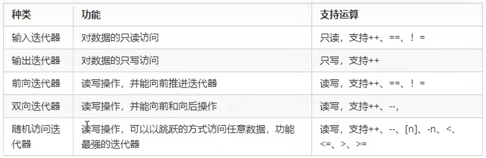

### 初识STL
C++的面向对象和泛型编程思想，**目的就是提高代码的复用性**，为建立数据结构和算法的一套标准，诞生了STL。   
#### STL基本概念
STL(Standard Template Library)标准模板库。   
* **STL从广义上分为：容器、算法、迭代器**
* 容器和算法之间通过迭代器进行无缝连接
* STL几乎所有的代码都采用了模板类或者模板函数
#### STL六大组件
**STL六大组件：容器、算法、迭代器、仿函数、适配器(配接器)、空间配置器**。
1. 容器：各种数据结构，如vector、list、deque、set、map等，用来存放数据
2. 算法：各种常用的算法，如sort、find、copy、for_each等
3. 迭代器：扮演了容器与算法之间的胶合剂
4. 仿函数：行为类似函数，可作为算法的某种策略
5. 适配器：一种用来修饰容器或者仿函数或迭代器接口的东西
6. 空间配置器：负责空间的配置与管理
#### STL中容器、算法、迭代器
* 容器：存放数据。   
**常用的数据结构：数组、链表、树、栈、队列、集合等**。    
这些容器又可分为`序列式容器`和`关联式容器`两种：     
序列式容器：强调值的排序，序列式容器中的每个元素均有固定的位置。    
关联式容器：二叉树结构，各元素之间没有严格的物理上的顺序关系。

* 算法：分为`质变算法`和`非质变算法`。有限的步骤，解决逻辑或数学上的问题，这一门学科称之为算法。
质变算法：运算过程中会改变区间内元素的值，如拷贝、替换、删除。     
非质变算法：运算过程中不会改变区间内的元素内容，例如查找、计数、遍历、寻找极值。

* 迭代器：提高一种方法，使之能够依次寻访某个容器所含的各个元素，而又无需暴漏该容器的内部表示方式。
**每个容器都有自己专属的迭代器，迭代器的使用非常类似于指针**。      
迭代器种类：
   
常用的容器中迭代器种类为**双向迭代器**，和**随机访问迭代器**。    
### Vector(向量)容器
STL中最常用的容器为`Vector`，可以理解为数组。    
STL中每个容器在使用前都需要包含头文件。 
`vector`存放内置数据类型：
* 容器:vector
* 算法:for_each
* 迭代器：vector<int>::iterator

#### vector存放内置数据类型
```c
#include <iostream>
#include <vector>
#include <algorithm> // STL标准算法头文件，使用for_each时需要
using namespace std;

void myPrint(int val)
{
    cout << val << endl;
}

void test()
{
    vector<int> v; // 创建一个容器

    // 向容器中插入数据(尾插)
    v.push_back(1);
    v.push_back(2);
    v.push_back(3);

    // 通过迭代器访问容器中的数据
    // vector<int>::iterator itBegin = v.begin(); // 起始迭代器，指向容器中第一个元素的位置
    // vector<int>::iterator itEnd = v.end();     // 结束迭代器，指向容器中最后一个元素的下一个位置

    // // 遍历方式1
    // while (itBegin != itEnd)
    // {
    //     cout << *itBegin << endl;
    //     itBegin++;
    // }

    // 遍历方式2：更常用
    for (vector<int>::iterator it = v.begin(); it != v.end(); it++)
    {
        cout << *it << endl;
    }

    // 遍历方式3：利用STL提供的遍历算法
    // for_each(v.begin(), v.end(), myPrint); // 需要定义一个打印输出的函数，传入函数名
}

int main()
{
    test();
    return 0;
}
```
#### vector中存放自定义数据类型，并打印输出
```c
#include <iostream>
#include <vector>
#include <string>
using namespace std;

// vector容器中存放自定义数据类型
class Person
{
public:
    string m_name;
    int m_age;
    Person(string name, int age)
    {
        this->m_name = name;
        this->m_age = age;
    }
};

void test1()
{
    vector<Person> v; // 创建一个存放自定义数据类型class的容器
    Person p1("张三", 1);
    Person p2("李四", 2);

    // 向容器中添加数据
    v.push_back(p1);
    v.push_back(p2);

    // 遍历容器中的数据
    for (vector<Person>::iterator it = v.begin(); it != v.end(); it++)
    {
        // (*it)的数据类型为Person
        cout << "name:" << (*it).m_name << ",age:" << (*it).m_age << endl;
    }
}

// 存放自定义数据类型：指针
void test2()
{
    vector<Person *> v;

    Person p1("张三", 1);
    Person p2("李四", 2);

    v.push_back(&p1);
    v.push_back(&p2);

    // 遍历容器
    for (vector<Person *>::iterator it = v.begin(); it != v.end(); it++)
    {
        cout << "name:" << (*it)->m_name << endl;
    }
}

int main()
{
    test1();
    test2();
    return 0;
}
```
#### vector容器嵌套容器
学习目标：容器中嵌套容器，将所有数据进行遍历输出。   
容器嵌套相当于一个二维数组。  
```c
#include <iostream>
#include <vector>
using namespace std;

// 容器嵌套输出
void test1()
{
    vector<vector<int>> v;

    // 创建小容器
    vector<int> v1;
    vector<int> v2;
    vector<int> v3;

    // 向小容器中添加数据
    for (int i = 0; i < 3; i++)
    {
        v1.push_back(i + 1);
        v2.push_back(i + 2);
        v3.push_back(i + 3);
    }

    // 将小容器插入到大容器中
    v.push_back(v1);
    v.push_back(v2);
    v.push_back(v3);

    // 通过大容器，把所有数据遍历一遍，与二维数组的遍历方式一样
    for (vector<vector<int>>::iterator it = v.begin(); it != v.end(); it++)
    {
        //  (*it) = vector<int>;  技巧：(*it)等于尖括号里的内容
        // 遍历小容器
        for (vector<int>::iterator vit = (*it).begin(); vit != (*it).end(); vit++)
        {
            cout << *vit << " "; // 输出小容器中的数据
        }
        cout << endl;
    }
}

int main()
{
    test1();
    return 0;
}
```