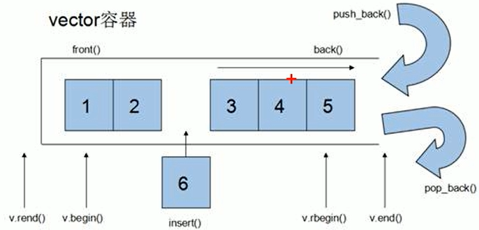

### vector容器基本概念
* 功能：`vector`数据结构和数组非常相似，也称为**单端数据**
* `vector`与普通数组区别：**数组是静态空间**，**而`vector`可以动态扩展**。
  * **动态扩展：并不是在原空间之后接新空间，而是找更大的内存空间，然后把原数据拷贝到新空间，释放原空间**。
  
* `vector`容器的迭代器是支持随机访问的迭代器
#### vector构造函数